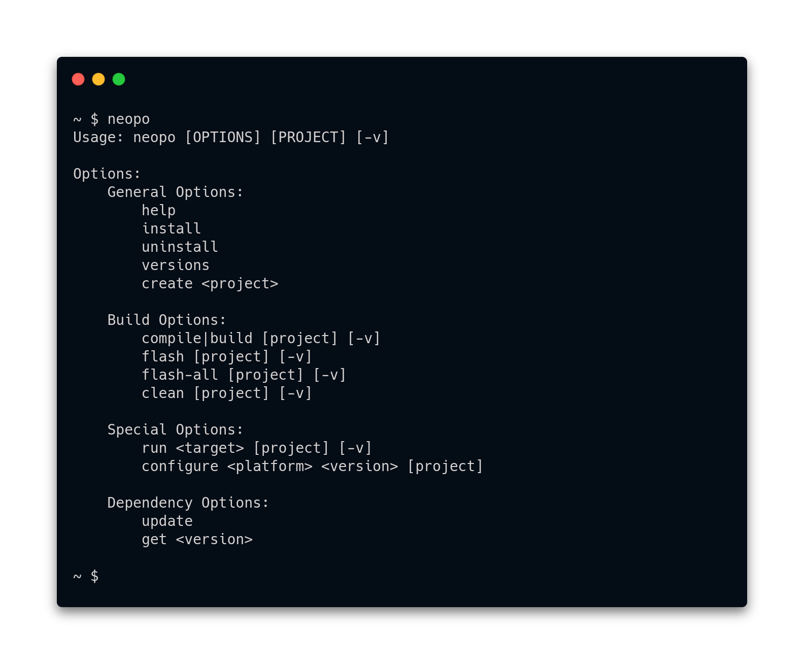

[](https://travis-ci.org/nrobinson2000/neopo)
[](https://community.particle.io/t/neopo-a-lightweight-solution-for-local-particle-development/56378?u=nrobinson2000)



## Features

- Builds Particle projects locally without any overhead.
- Compatible with Particle Workbench and Particle CLI.
- Installs and manages necessary Particle dependencies.
- Built with Python using only the standard library.
- Supports Linux, macOS, Windows, and Raspberry Pi.
- Supports tab completion to assist development.

## Installation

### Linux and macOS

Open a terminal and run:

```bash
bash <( curl -sL https://raw.githubusercontent.com/nrobinson2000/neopo/dev/install.sh )
```

### Windows

Open PowerShell and run:

```powershell
iex ((New-Object System.Net.WebClient).DownloadString('https://raw.githubusercontent.com/nrobinson2000/neopo/dev/install.ps1'))
```

## Examples

### Creating a project

```bash
$ neopo create myProject
```

### Configuring a project

```bash
$ neopo configure argon 1.5.2 myProject
```

### Building a project

```bash
$ neopo build myProject
```

### Flashing a project

```bash
$ neopo flash myProject
```

### Running a specific Makefile target

```bash
$ neopo run clean-debug myProject
```

### Uninstalling

```bash
$ neopo uninstall
```

**Note: Specifying the project directory is optional if your current working directory is a Particle project. Tab completion can also find valid projects in the current working directory.**

**For example:**

```bash
$ cd myProject

$ neopo build

$ neopo flash
```
